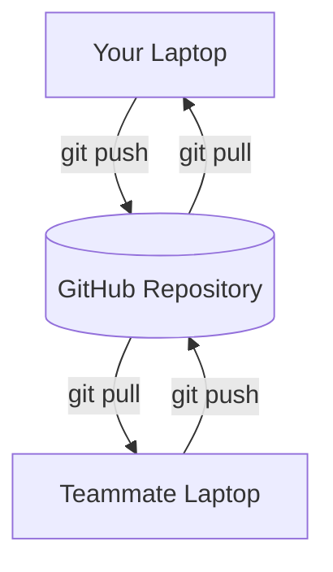

# 🚀 Lesson 01: Git vs GitHub (Video 1 Notes)

This note is your quick-start guide for understanding the **difference between Git and GitHub**.

---

## 🎯 One-Line Difference

- **Git** = Version control tool (runs on your computer).
- **GitHub** = Cloud platform to host and collaborate on Git repositories.

---

## 🧠 Simple Analogy

- **Git** is like your notebook where every change is saved with history.
- **GitHub** is like Google Drive for that notebook, where your team can also access and contribute.

---

## 📊 Git vs GitHub (Quick Comparison)

| Feature | Git | GitHub |
|---|---|---|
| What it is | Version control system | Cloud hosting for Git repos |
| Where it runs | Local machine | Online platform |
| Internet required | No (for local work) | Yes (for sync/collab) |
| Main use | Track code history | Share + collaborate |
| Core commands | `git init`, `git add`, `git commit` | `git push`, `git pull`, Pull Requests |

---

## 🔁 Visual 1: How Git Helps (Local Undo)

```mermaid
flowchart LR
    A[Code Working ✅] -->|git commit| B[Save Point]
    B --> C[New Change]
    C --> D[Bug Introduced ❌]
   D -->|git restore / reset| B
```



✅ Meaning: If something breaks, Git lets you go back to a safe version.

---

## ☁️ Visual 2: How GitHub Helps (Team Collaboration)



✅ Meaning: Everyone syncs work through GitHub.

---

## 🧪 Real Use Cases

1. **Safe Undo**
   - You changed UI and broke layout.
   - Use Git history to restore last working commit.

2. **Parallel Work (Branching)**
   - One branch for login feature, another for profile feature.
   - Work independently, then merge.

3. **Team Review**
   - Push branch to GitHub.
   - Create Pull Request and get feedback before merge.

---

## ⚡ Starter Commands (Video 1 Friendly)

```bash
git init
git add .
git commit -m "Initial commit"
git branch -M main
git remote add origin <repo-url>
git push -u origin main
```

---

## ✅ Summary

- Use **Git** to track and manage your code history locally.
- Use **GitHub** to store code online and collaborate with others.
- Together, they give you safety, teamwork, and professional workflow.
