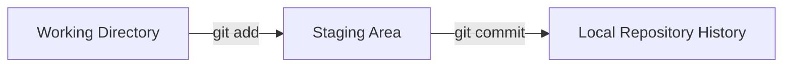

# 🚀 Lesson 02: Git Setup + First Commands (Video 2 Notes)

This lesson starts your **real command-line journey**. We stay beginner-friendly and go step by step.

---

## 🎯 Day 02 Goal

- Install Git correctly.
- Connect your identity with Git and GitHub.
- Run your first safe Git commands with full understanding.

---

## ✅ Prerequisite Check

Before typing commands, make sure:

- Git is installed on your laptop.
- You already have a GitHub account.
- Day 01 concept is clear: Git = local, GitHub = cloud.

---

## 1) Install and Verify Git

### Linux (Ubuntu/Debian)

```bash
sudo apt update
sudo apt install git -y
git --version
```

### macOS (Homebrew)

```bash
brew install git
git --version
```

### Windows

- Install from official Git website.
- Open Git Bash and check:

```bash
git --version
```

✅ Meaning: `git --version` confirms Git is ready.

---

## 2) Set Your Git Identity (Important)

```bash
git config --global user.name "Your Name"
git config --global user.email "you@example.com"
git config --global init.defaultBranch main
git config --global --list
```

### Why this matters

- `user.name` and `user.email` are attached to your commits.
- `init.defaultBranch main` makes new repos start with `main` (modern standard).
- `--list` helps you verify everything quickly.

---

## 3) Login to GitHub (Modern + Professional)

If you have GitHub CLI (`gh`) installed, use this clean method:

```bash
gh auth login
```

Recommended choices during login:
- GitHub.com
- HTTPS
- Authenticate with browser

Then verify:

```bash
gh auth status
```

✅ Meaning: Your terminal is now connected to your GitHub account.

---

## 4) Your First Local Repository (Safe Practice)

```bash
mkdir my-first-git-project
cd my-first-git-project
git init
git status
```

### Understand deeply

- `git init` creates a hidden `.git` folder (Git brain/history).
- `git status` is your best friend; use it very frequently.

---

## 5) First Commit (Step by Step)

```bash
echo "# My First Project" > README.md
git status
git add README.md
git status
git commit -m "Add initial README"
git log --oneline
```

### Command meaning

- `git add` = stage changes (prepare snapshot).
- `git commit` = save snapshot into history.
- `git log --oneline` = quick readable history.

---

## 🔁 Visual: Local Git Workflow (Day 02)



✅ Think like this: **Work → Stage → Commit**.

---

## ⚠️ Beginner Mistakes to Avoid

- Commit without checking `git status`.
- Use random commit messages like `update` or `final final`.
- Forget to set name/email before first commit.

Use clear commit messages like:
- `Add README`
- `Fix typo in lesson notes`

---

## 🧪 Mini Practice (Do This Today)

1. Create one folder.
2. Initialize Git.
3. Create 2 files (`README.md`, `notes.txt`).
4. Commit each change with a meaningful message.
5. Check history with `git log --oneline`.

---

## ✅ Day 02 Summary

- Git installed and verified.
- Git identity configured.
- GitHub login completed.
- First repository and first commit done.
- You now understand the real base workflow.
