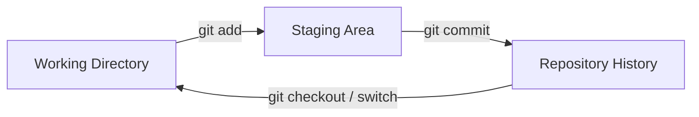

# 🚀 Lesson 03: Git Basics in Depth (Video 3 Notes)

Day 03 is about **fewer commands, deeper understanding**.

---

## 🎯 Day 03 Goal

Master the core flow with confidence:
- See what changed.
- Stage intentionally.
- Commit cleanly.
- Read history like a pro beginner.

---

## 🧩 The 3 Git Zones (Must Understand)

1. **Working Directory**
   - Files you are editing now.

2. **Staging Area (Index)**
   - Files selected for next commit.

3. **Repository (History)**
   - Saved snapshots (commits).



---

## 🔍 Command 1: `git status` (Your Daily Dashboard)

```bash
git status
```

Use it to know:
- Which files are modified.
- Which files are staged.
- Which branch you are on.

💡 Rule: Run `git status` before and after every major step.

---

## 📝 Command 2: `git add` (Stage with Intent)

```bash
git add file.txt
git add .
```

Deep idea:
- `git add file.txt` = controlled staging (safer).
- `git add .` = stage all changes in current folder.

Best beginner habit:
- Prefer specific files first, not always `git add .`.

---

## 💾 Command 3: `git commit` (Meaningful Snapshot)

```bash
git commit -m "Add login form structure"
```

A commit message should explain:
- What changed
- Why it changed (if needed)

Bad:
- `update`

Good:
- `Fix README typo`
- `Add initial project notes`

---

## 📚 Command 4: `git log --oneline` (History Reading)

```bash
git log --oneline
```

Why this matters:
- You can track project story quickly.
- You can identify where mistakes entered.

---

## 🔎 Command 5: `git diff` (See Exact Changes)

```bash
git diff
git diff --staged
```

Difference:
- `git diff` = unstaged changes.
- `git diff --staged` = staged changes.

This builds strong confidence before commit.

---

## 🧪 Practice Drill (Day 03)

1. Edit one file.
2. Run `git status`.
3. Run `git diff`.
4. Stage only that file.
5. Run `git diff --staged`.
6. Commit with clear message.
7. View history with `git log --oneline`.

---

## 🛡️ Golden Beginner Rules

- Always check before commit.
- Keep commits small and focused.
- Write commit messages your future self can understand.
- One logical change = one commit.

---

## ✅ Day 03 Summary

You now deeply understand the most important Git basics:
- `status`
- `add`
- `commit`
- `log`
- `diff`

If these 5 commands are strong, advanced Git becomes much easier.
