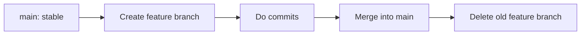

# 🚀 Lesson 04: Branching and Merging Basics (Video 4 Notes)

Day 04 teaches you how to work on features safely without breaking main code.

---

## 🎯 Day 04 Goal

- Understand why branches exist.
- Create and switch branches using modern commands.
- Merge changes back to `main` cleanly.
- Follow safe branch naming and commit habits.

---

## 🧠 Core Idea

A branch is an independent line of work.

- `main` = stable timeline.
- `feature/...` = your working timeline.

This lets you experiment without risk.

---

## 🔁 Visual: Branching Workflow



---

## 1) Create and Switch Branch (Modern)

```bash
git switch -c feature/navbar-improvement
```

Deep meaning:
- `switch` is the modern command for branch movement.
- `-c` creates and switches in one step.

Check where you are:

```bash
git branch
```

---

## 2) Work and Commit on Feature Branch

```bash
git status
git add .
git commit -m "Improve navbar spacing"
```

Best practice:
- Make small focused commits.
- One logical change = one commit.

---

## 3) Merge Feature into Main

```bash
git switch main
git merge feature/navbar-improvement
```

If no conflicts, merge completes directly.

Then clean up branch:

```bash
git branch -d feature/navbar-improvement
```

---

## ⚠️ If Merge Conflict Happens

1. Open conflicted file.
2. Decide final code.
3. Save file.
4. Stage and commit.

```bash
git add .
git commit -m "Resolve merge conflict in navbar styles"
```

---

## 📌 Branch Naming Best Practices

Use readable names:
- `feature/login-form`
- `fix/header-overlap`
- `docs/day4-notes`

Avoid:
- `newbranch`
- `temp`
- `finalfinal`

---

## 🧪 Practice Drill (Day 04)

1. Create branch `feature/day4-practice`.
2. Edit one file.
3. Commit with clear message.
4. Switch to `main` and merge.
5. Delete merged feature branch.

---

## ✅ Day 04 Summary

You learned safe development flow:
- Create branch
- Build feature
- Merge to `main`
- Clean old branch

This is the foundation of professional teamwork.
