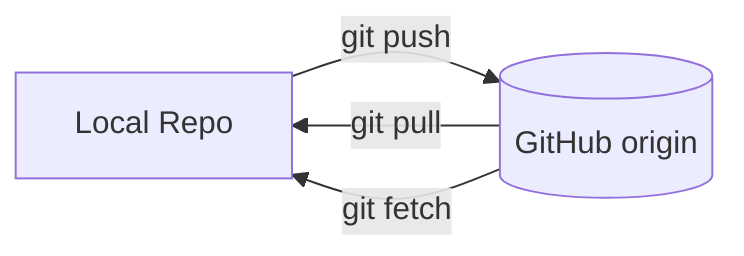

# 🚀 Lesson 05: Remote Workflow Basics (Video 5 Notes)

Day 05 moves from local Git to team-ready GitHub syncing.

---

## 🎯 Day 05 Goal

- Connect local repo to GitHub remote.
- Push and pull with confidence.
- Understand `clone`, `fetch`, `pull`, `push` deeply.
- Follow safe daily sync routine.

---

## 🧠 Core Idea

- Local repo = your machine history.
- Remote repo = shared cloud history.
- You sync both timelines regularly.

---

## ☁️ Visual: Remote Sync Cycle



---

## 1) Connect Local Repo to GitHub

```bash
git remote add origin <repo-url>
git remote -v
```

Why:
- `origin` is the default remote name.
- `-v` verifies fetch/push URLs.

---

## 2) First Push (Set Upstream)

```bash
git push -u origin main
```

Deep meaning:
- `-u` links local `main` to remote `origin/main`.
- Future pushes can be just `git push`.

---

## 3) Clone Existing Repo

```bash
git clone <repo-url>
cd <repo-folder>
```

Use this when project already exists on GitHub.

---

## 4) Fetch vs Pull (Important Difference)

```bash
git fetch
git pull
```

- `fetch` downloads remote updates but does not merge.
- `pull` = fetch + merge into current branch.

Best practice for beginners:
- Run `git fetch` and inspect first when collaborating.

Modern team note:
- Prefer rebased pulls to keep history cleaner in many teams:

```bash
git pull --rebase
```

- `git pull --rebase` replays your local commits on top of latest remote changes.

---

## 5) Daily Safe Sync Routine

```bash
git switch main
git pull
git switch -c feature/small-change
# work + commit
git push -u origin feature/small-change
```

Then open Pull Request on GitHub.

---

## 🔐 Modern Best Practices

- Prefer HTTPS + GitHub CLI auth for easy setup.
- Pull latest `main` before starting new feature.
- Push feature branches, avoid direct large commits to `main`.
- Use Pull Requests for review and traceability.
- Keep `main` protected on GitHub in team projects.

---

## 🧪 Practice Drill (Day 05)

1. Create empty repo on GitHub.
2. Connect local repo with `origin`.
3. Push `main` with upstream.
4. Add one commit and push again.
5. Test `git fetch` then `git pull`.

---

## ✅ Day 05 Summary

You can now sync local and cloud repositories professionally:
- connect remote
- push safely
- fetch/pull correctly
- collaborate with branch-first workflow
