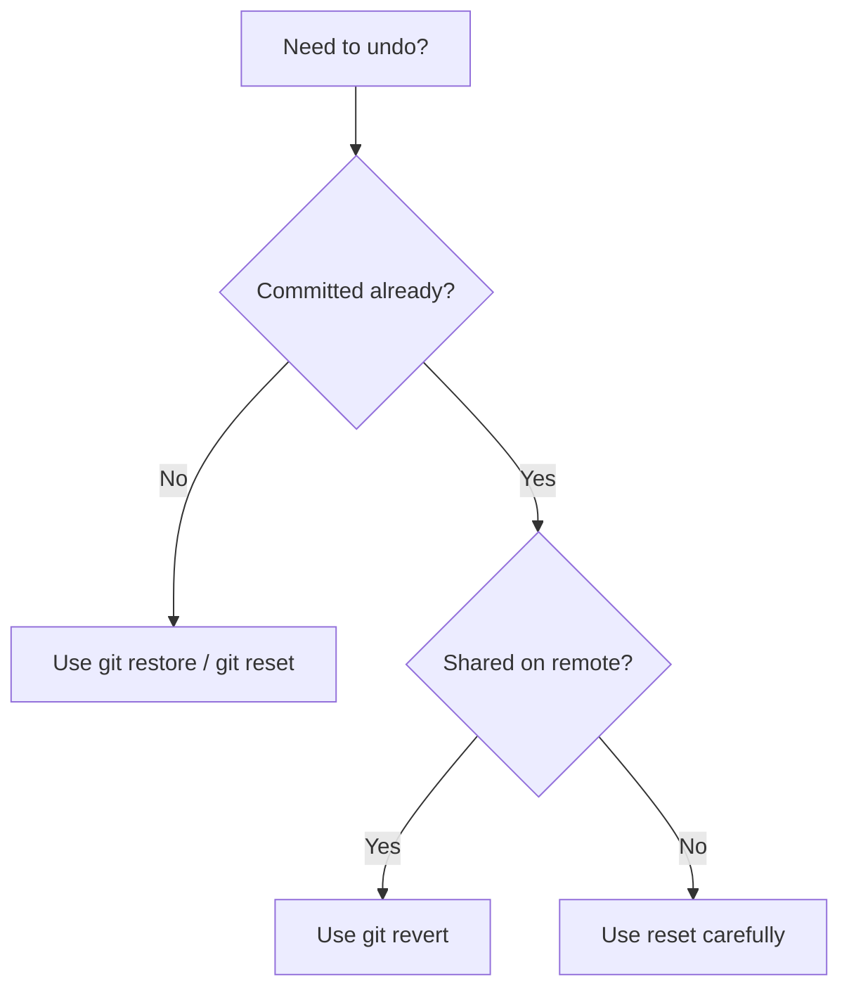

# 🚀 Lesson 06: Safe Undo and Recovery Basics (Video 6 Notes)

Day 06 is about fixing mistakes confidently using modern, beginner-safe commands.

---

## 🎯 Day 06 Goal

- Understand what can be undone safely.
- Use `restore`, `reset`, `revert`, and `stash` correctly.
- Recover from common beginner mistakes.

---

## 🧠 Golden Rule Before Undo

Always check current state first:

```bash
git status
git log --oneline -5
```

This prevents accidental data loss.

---

## 🔁 Visual: Undo Decision Map



---

## 1) Undo Unstaged File Changes

```bash
git restore file.txt
```

Use when:
- You edited a file but want last committed version.

---

## 2) Unstage a File (Keep Changes)

```bash
git restore --staged file.txt
```

Use when:
- You added wrong file to staging by mistake.

---

## 3) Undo Last Commit Safely (Local)

```bash
git reset --soft HEAD~1
```

Meaning:
- Removes last commit.
- Keeps all changes staged.

If you want changes unstaged:

```bash
git reset HEAD~1
```

---

## 4) Undo a Commit That Is Already Pushed

```bash
git revert <commit-hash>
```

Best practice:
- Use `revert` for shared history.
- Avoid rewriting shared commit history.

---

## 5) Save Work Temporarily with Stash

```bash
git stash
git stash list
git stash pop
```

Use when:
- You need to quickly switch task/branch without committing half-done work.

---

## 6) Emergency Recovery with Reflog (Life Saver)

```bash
git reflog
```

Why this matters:
- `reflog` shows where `HEAD` was recently.
- If you ran a wrong reset, you can recover by resetting to an older reflog entry.

---

## ⚠️ Safety Notes

- Do not use force push on shared branches unless necessary and understood.
- Prefer `revert` over history rewrite when collaborating.
- Run `git status` after each undo step.
- Before risky undo commands, create a temporary safety branch.

---

## 🧪 Practice Drill (Day 06)

1. Edit a file and undo with `git restore`.
2. Stage file then unstage with `git restore --staged`.
3. Make a commit then undo it with `git reset --soft HEAD~1`.
4. Make another commit and revert it with `git revert`.
5. Test `git stash` and `git stash pop`.

---

## ✅ Day 06 Summary

You can now recover from mistakes like a confident beginner:
- restore file changes
- unstage safely
- reset local commits carefully
- revert shared commits professionally
- stash temporary work cleanly
