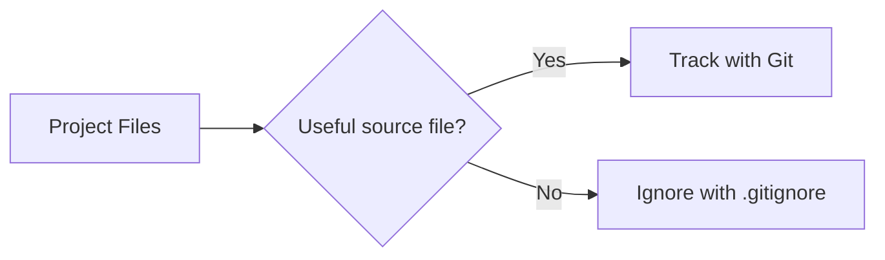

# 🚀 Lesson 07: .gitignore and Repository Hygiene (Video 7 Notes)

Day 07 teaches you how to keep repositories clean, secure, and professional.

---

## 🎯 Day 07 Goal

- Understand what should never be committed.
- Use `.gitignore` correctly from day one.
- Keep repo size clean and collaboration-friendly.
- Apply basic security hygiene.

---

## 🧠 Core Idea

Git tracks what you tell it to track.

`.gitignore` tells Git what **not** to track.

Typical examples:
- Build output folders (`dist/`, `build/`)
- Dependency folders (`node_modules/`)
- Environment files (`.env`)
- IDE or OS junk (`.vscode/`, `.DS_Store`)

---

## 🔁 Visual: Clean Repo Flow



---

## 1) Create a `.gitignore` File

```bash
touch .gitignore
```

Example starter content:

```gitignore
# Node
node_modules/
dist/

# Environment
.env

# Logs
*.log

# OS / Editor
.DS_Store
.vscode/
```

---

## 2) Check What Git Is Tracking

```bash
git status
```

Deep note:
- If a file was already tracked before adding it to `.gitignore`, Git keeps tracking it.

To stop tracking but keep file locally:

```bash
git rm --cached <file>
```

---

## 3) Commit `.gitignore` Early

```bash
git add .gitignore
git commit -m "Add base .gitignore"
```

Best practice:
- Add `.gitignore` at project start, not later.

---

## 🔐 Security Basics (Beginner Level)

Never commit:
- API keys
- Passwords
- Access tokens
- Private certificates

If secret is committed by mistake:
1. Rotate/revoke secret immediately.
2. Remove from code.
3. Commit fix.
4. (Advanced later) clean history.

---

## 🧪 Practice Drill (Day 07)

1. Create `.gitignore`.
2. Add at least 5 ignore patterns.
3. Create ignored file (e.g., `.env`) and confirm it does not appear in `git status`.
4. Commit only source files and `.gitignore`.

---

## ✅ Day 07 Summary

You can now maintain clean repositories by:
- ignoring noisy/generated files
- protecting sensitive data
- keeping commit history professional
