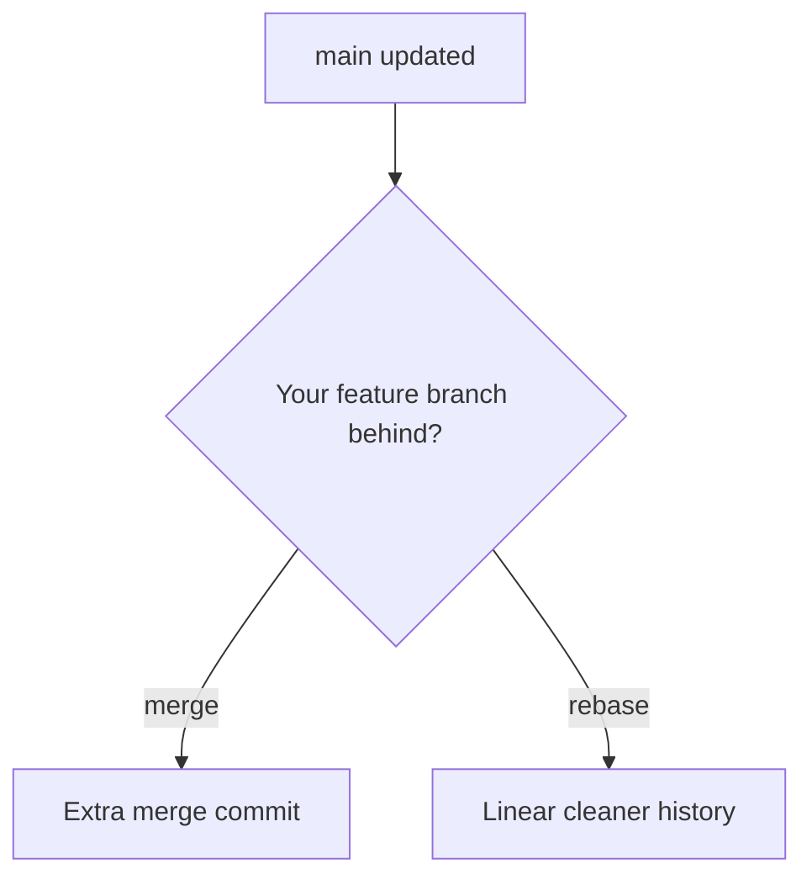

# 🚀 Lesson 09: Rebase and Clean History (Intermediate Video 1)

This is your first Intermediate lesson. We keep it step-by-step but go deeper in real team workflows.

---

## 🎯 Lesson Goal

- Understand what `rebase` really does.
- Keep branch history clean before Pull Request.
- Use safe rebase workflow with confidence.
- Avoid common rebase mistakes.

---

## 🧠 Why Rebase Matters

In many teams, clean history helps:
- easier code review
- easier debugging
- clearer project timeline

`rebase` rewrites commit base so your feature branch sits on latest `main`.

---

## 🔁 Visual: Merge vs Rebase



---

## 1) Start from Updated Main

```bash
git switch main
git pull --rebase
git switch feature/your-feature
```

Why:
- Rebase should use fresh `main` to reduce conflicts.

---

## 2) Rebase Feature Branch onto Main

```bash
git rebase main
```

What happens:
- Git temporarily removes your feature commits.
- Moves branch pointer to latest `main`.
- Reapplies your commits one by one.

---

## 3) Handle Conflicts During Rebase

When conflict appears:

```bash
git status
# edit conflicted files
git add .
git rebase --continue
```

If needed:

```bash
git rebase --abort
```

Best practice:
- Resolve small conflicts carefully and continue.
- Abort only when you need to restart safely.

---

## 4) Push After Rebase (Important)

Because history was rewritten:

```bash
git push --force-with-lease
```

Use this, not plain force:
- `--force-with-lease` is safer for team branches.

---

## 🛡️ Team Safety Rules

- Rebase your own feature branch.
- Do not rebase shared branch history unless team agrees.
- Before rebase, create safety branch when unsure:

```bash
git branch backup/feature-before-rebase
```

---

## 🧪 Practice Drill

1. Create feature branch from `main`.
2. Make 2 commits.
3. Update `main` with one new commit.
4. Rebase feature branch onto `main`.
5. Resolve one conflict (if generated).
6. Push with `--force-with-lease`.

---

## ✅ Summary

You learned intermediate clean-history workflow:
- update main
- rebase feature
- resolve conflicts carefully
- push safely after rewritten history
