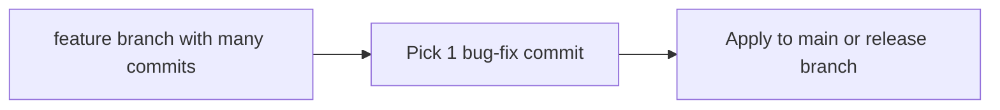

# 🚀 Lesson 10: Cherry-pick and Hotfix Workflow (Intermediate Video 2)

This lesson teaches selective commit movement and production-style hotfix handling.

---

## 🎯 Lesson Goal

- Understand when to use `cherry-pick`.
- Move only required commit(s) between branches.
- Apply hotfix flow without mixing unrelated work.

---

## 🧠 Core Use Case

You fixed a bug in one branch and need same fix in another branch.

Instead of merging full branch, pick only exact commit.

---

## 🔁 Visual: Selective Commit Transfer



---

## 1) Find Commit Hash

```bash
git log --oneline
```

Copy the commit hash you want (example: `a1b2c3d`).

---

## 2) Switch to Target Branch

```bash
git switch main
```

Or in release flow:

```bash
git switch release/1.0
```

---

## 3) Apply Cherry-pick

```bash
git cherry-pick a1b2c3d
```

For multiple commits:

```bash
git cherry-pick <hash1> <hash2>
```

---

## 4) Handle Conflict if Needed

```bash
git status
# fix files
git add .
git cherry-pick --continue
```

Abort if wrong pick:

```bash
git cherry-pick --abort
```

---

## 5) Hotfix Workflow (Beginner-Intermediate)

```bash
git switch main
git pull --rebase
git switch -c hotfix/login-crash
# fix issue
git add .
git commit -m "Fix login crash on empty password"
git switch main
git merge hotfix/login-crash
git push
```

Then cherry-pick same fix into release branch if required.

---

## 🛡️ Best Practices

- Keep hotfix branch focused on one problem.
- Use clear commit messages including impact area.
- Prefer PR review even for hotfix when time allows.
- Tag releases after critical fixes (you will cover tags next).

---

## 🧪 Practice Drill

1. Create a feature branch and make 3 commits.
2. Pick only 1 commit into `main` using `cherry-pick`.
3. Verify with `git log --oneline`.
4. Simulate a small hotfix branch and merge it.

---

## ✅ Summary

You can now move commits precisely and handle real-world urgent fixes safely.
