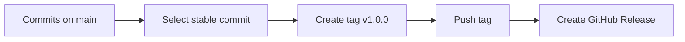

# 🚀 Lesson 11: Tags and Releases Workflow (Intermediate Video 3)

This lesson teaches how teams mark stable versions and ship releases in a professional way.

---

## 🎯 Lesson Goal

- Understand lightweight vs annotated tags.
- Create and push tags correctly.
- Connect Git tags with GitHub Releases.
- Use semantic versioning basics (`v1.0.0` style).

---

## 🧠 Why Tags Matter

A tag is a fixed label on a specific commit.

Common use:
- release points (`v1.0.0`, `v1.1.0`)
- rollback references
- stable deployment markers

Unlike branches, tags do not move automatically.

---

## 🔁 Visual: Commit to Release



---

## 1) See Existing Tags

```bash
git tag
```

With details:

```bash
git show v1.0.0
```

---

## 2) Create Tag (Recommended: Annotated)

```bash
git tag -a v1.0.0 -m "Release version 1.0.0"
```

Why annotated tags are better:
- include message + metadata
- better for production and audit trails

Lightweight tag (less metadata):

```bash
git tag v1.0.0
```

---

## 3) Push Tags to Remote

Push one tag:

```bash
git push origin v1.0.0
```

Push all tags:

```bash
git push origin --tags
```

---

## 4) Tag Older Commit (If Needed)

Find commit:

```bash
git log --oneline
```

Create tag on specific hash:

```bash
git tag -a v0.9.0 <commit-hash> -m "Backfill pre-release tag"
```

---

## 5) GitHub Release Connection

Typical workflow:
1. Push tag to GitHub.
2. Open repository Releases page.
3. Create release from that tag.
4. Add release notes (features, fixes, breaking changes).

---

## 🛡️ Versioning Best Practices

- Use semantic versioning style:
  - `MAJOR.MINOR.PATCH`
  - `v1.2.3`
- Tag only tested, stable commits.
- Keep release notes concise and clear.
- Do not retag same version after publishing.

---

## 🧪 Practice Drill

1. Create 2 commits.
2. Add annotated tag `v1.0.0` on latest commit.
3. Push tag to origin.
4. Create one more commit and tag `v1.0.1`.
5. Verify with `git tag` and `git show`.

---

## ✅ Summary

You can now mark stable versions and prepare clean release workflow with tags and GitHub Releases.
