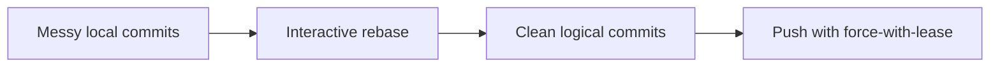

# 🚀 Lesson 12: Interactive Rebase and Commit Hygiene (Intermediate Video 4)

This lesson helps you clean commit history before opening or merging a Pull Request.

---

## 🎯 Lesson Goal

- Use interactive rebase to refine commit history.
- Squash noisy commits into meaningful units.
- Reword commit messages to professional quality.
- Keep history readable for reviewers and future debugging.

---

## 🧠 Core Idea

Interactive rebase lets you edit recent commits before sharing.

You can:
- reorder commits
- squash multiple commits
- edit commit messages
- drop accidental commits

---

## 🔁 Visual: Commit Cleanup Flow



---

## 1) Inspect Recent History

```bash
git log --oneline -10
```

Pick how many commits to clean (example: last 4).

---

## 2) Start Interactive Rebase

```bash
git rebase -i HEAD~4
```

Editor opens with lines like:
- `pick` = keep commit
- `reword` = change commit message
- `squash` = combine commit with previous one
- `drop` = remove commit

---

## 3) Typical Cleanup Example

Suppose history is:
- `fix typo`
- `fix typo again`
- `update button`
- `final changes`

Better final history could become:
- `Improve button interaction and text`

How:
- Keep first as `pick`
- Mark others as `squash`
- Write one clear final message

---

## 4) Resolve Conflicts if Rebase Stops

```bash
git status
# resolve files
git add .
git rebase --continue
```

Abort if needed:

```bash
git rebase --abort
```

---

## 5) Push Cleaned History Safely

After rebase rewrite:

```bash
git push --force-with-lease
```

Why:
- history changed, normal push will fail
- `--force-with-lease` is safer than plain `--force`

---

## 🛡️ Commit Hygiene Rules

- One commit = one logical change.
- Avoid messages like `final`, `update`, `misc`.
- Use clear action words:
  - `Add`
  - `Fix`
  - `Refactor`
  - `Improve`
- Rebase before PR when local history is noisy.

---

## 🧪 Practice Drill

1. Create 4 small commits with messy messages.
2. Run `git rebase -i HEAD~4`.
3. Squash into 1–2 clean commits.
4. Reword messages professionally.
5. Push with `--force-with-lease`.

---

## ✅ Summary

You can now convert messy development history into clean review-ready commits using interactive rebase.
