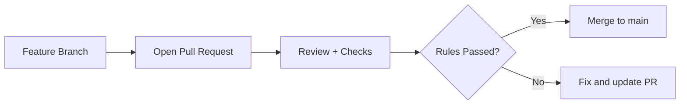

# 🚀 Lesson 13: Branch Protection and Rulesets (Industry Daily)

This lesson covers one of the most important real-world safeguards in GitHub teams.

---

## 🎯 Lesson Goal

- Protect `main` from direct risky pushes.
- Enforce Pull Request based workflow.
- Apply minimum quality gates before merge.
- Understand modern GitHub Rulesets approach.

---

## 🧠 Why This Is Industry-Critical

Without branch protection:
- accidental force push can break history
- unreviewed code can reach production
- CI failures can still be merged

Branch protection/rulesets solve this.

---

## 🔁 Visual: Safe Merge Pipeline



---

## 1) Configure Protection on `main` (GitHub UI)

Go to:
- Repository → Settings → Rules → Rulesets (recommended)

Minimum settings for beginners:
- Require a pull request before merging
- Require at least 1 approval
- Require status checks to pass
- Block force pushes
- Block branch deletion

---

## 2) Create Required Status Checks (CI)

In team projects, wire checks like:
- test pipeline
- lint pipeline
- build verification

Rules should block merge when checks fail.

---

## 3) Local Daily Flow with Protected Main

```bash
git switch main
git pull --rebase
git switch -c feature/small-safe-change
# code + commit
git push -u origin feature/small-safe-change
```

Then merge only via PR after checks/approval.

---

## 4) Emergency Admin Handling

If urgent production incident happens:
- Use dedicated hotfix branch
- Keep PR small and review quickly
- Avoid disabling protections unless absolutely required

If protection is temporarily bypassed, document reason clearly.

---

## 🛡️ Team Best Practices

- Keep `main` always deployable.
- Prefer small PRs for faster approval.
- Protect release branches too (`release/*`).
- Use CODEOWNERS for mandatory reviewer ownership (next lesson).

---

## 🧪 Practice Drill

1. Enable branch protection/ruleset on `main`.
2. Try direct push to `main` (it should fail).
3. Push feature branch and open PR.
4. Merge only after checks + review.

---

## ✅ Summary

You now know how to enforce safe collaboration policies that real engineering teams use daily.
