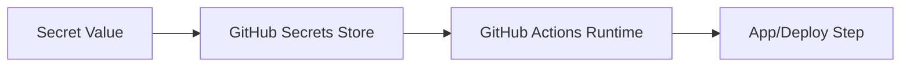

# 🚀 Lesson 14: GitHub Secrets and Environment Security (Industry Daily)

This lesson covers secure secret handling in GitHub workflows and repositories.

---

## 🎯 Lesson Goal

- Understand where secrets should live.
- Store and use GitHub Secrets safely.
- Avoid secret leaks in code and logs.
- Apply beginner-to-intermediate security habits.

---

## 🧠 Core Security Rule

Never commit secrets into repository files.

Examples of secrets:
- API keys
- access tokens
- database passwords
- cloud credentials

---

## 🔁 Visual: Secret Usage Path



---

## 1) Add Secrets in GitHub

Location options:
- Repository secrets (repo-specific)
- Environment secrets (staging/production)
- Organization secrets (shared across repos)

Recommended start:
- use Environment secrets for deployment stages

---

## 2) Use Secret in GitHub Actions

Example usage in workflow:

```yaml
env:
  API_TOKEN: ${{ secrets.API_TOKEN }}
```

Important:
- never print secret values in logs
- do not echo full env values

---

## 3) Local Development Safety

Use `.env` locally and ignore it:

```bash
echo ".env" >> .gitignore
git add .gitignore
git commit -m "Ignore local environment file"
```

---

## 4) If a Secret Leaks

Immediate response:
1. Revoke/rotate leaked secret.
2. Replace in provider dashboard.
3. Update GitHub Secret value.
4. Audit logs and affected systems.

Do this immediately; do not wait.

---

## 🛡️ Best Practices

- Use least-privilege credentials.
- Separate secrets by environment.
- Rotate secrets regularly.
- Prefer short-lived tokens where possible.
- Add secret scanning in repo settings if available.

---

## 🧪 Practice Drill

1. Add one test secret in repository settings.
2. Reference it in a simple workflow.
3. Confirm workflow uses it without exposing value.
4. Rotate that secret once as practice.

---

## ✅ Summary

You can now manage GitHub secrets safely for real projects and collaborative workflows.
