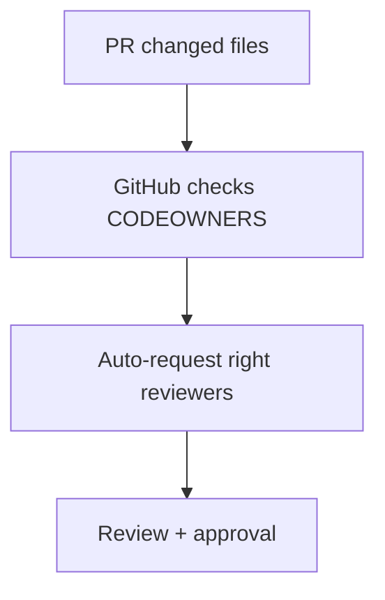

# 🚀 Lesson 15: CODEOWNERS and PR Review Standards (Industry Daily)

This lesson teaches enforceable code ownership and review quality standards.

---

## 🎯 Lesson Goal

- Add CODEOWNERS for automatic reviewer assignment.
- Define practical PR review checklist.
- Improve review quality and ownership clarity.

---

## 🧠 Why CODEOWNERS Matters

When repositories grow:
- ownership becomes unclear
- wrong reviewers are requested
- critical modules get under-reviewed

CODEOWNERS fixes this by mapping paths to responsible reviewers.

---

## 🔁 Visual: Ownership-Based Review



---

## 1) Create CODEOWNERS File

Create one of these paths:
- `.github/CODEOWNERS` (recommended)
- `CODEOWNERS` in repo root
- `docs/CODEOWNERS`

Example:

```txt
# Global default owner
* @your-github-username

# Frontend area
frontend/ @frontend-lead

# Backend area
backend/ @backend-lead

# Workflows require platform review
.github/workflows/ @devops-lead
```

---

## 2) Enforce Review Requirement

In branch protection/rulesets:
- Require pull request reviews before merge
- Require review from Code Owners

This creates accountable merge decisions.

---

## 3) PR Review Checklist (Practical)

Before approving, check:
- correctness of logic
- tests updated/added
- security impact
- performance risk
- rollback clarity

For beginners:
- ask questions in comments instead of silent approval

---

## 4) Recommended PR Structure

- small and focused diff
- clear title
- clear description
- test evidence
- linked issue/task

---

## 🛡️ Best Practices

- Keep CODEOWNERS updated when team changes.
- Avoid massive PRs with mixed topics.
- Use Draft PR early for early feedback.
- Treat reviews as collaboration, not gatekeeping.

---

## 🧪 Practice Drill

1. Add `.github/CODEOWNERS` file.
2. Configure required code owner review.
3. Open PR changing owned path.
4. Verify reviewer is auto-requested.

---

## ✅ Summary

You now have a structured review system with clear ownership and higher merge quality.
