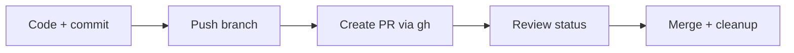

# 🚀 Lesson 16: Daily GitHub CLI Tips and Troubleshooting (Industry Daily)

This lesson gives practical daily commands and fixes used by working teams.

---

## 🎯 Lesson Goal

- Speed up daily GitHub operations with `gh` CLI.
- Manage PRs/issues from terminal.
- Solve common auth and sync problems quickly.

---

## 🧠 Why This Matters

GUI is useful, but CLI improves speed and repeatability for daily workflows.

---

## 🔁 Visual: Daily CLI Loop



---

## 1) Authentication and Setup

```bash
gh auth login
gh auth status
gh repo view --web
```

Use this once per machine and verify status.

---

## 2) PR Operations from Terminal

Create PR:

```bash
gh pr create --fill
```

List PRs:

```bash
gh pr list
```

Check PR details:

```bash
gh pr view --web
```

Merge PR:

```bash
gh pr merge --squash --delete-branch
```

---

## 3) Issue Workflow Basics

Create issue:

```bash
gh issue create --title "Bug: login error" --body "Steps to reproduce..."
```

List issues:

```bash
gh issue list
```

---

## 4) Common Problems and Fast Fixes

### Problem A: Authentication failed

```bash
gh auth logout
gh auth login
```

### Problem B: Non-fast-forward push rejected

```bash
git fetch
git rebase origin/main
git push --force-with-lease
```

### Problem C: Wrong upstream branch

```bash
git branch --set-upstream-to=origin/<branch-name>
```

---

## 🛡️ Tips and Tricks (Daily Use)

- Use aliases for repetitive commands.
- Keep branch names meaningful and short.
- Open Draft PR early to get feedback fast.
- Merge with squash for cleaner history (team preference dependent).

---

## 🧪 Practice Drill

1. Authenticate with `gh`.
2. Create branch and push changes.
3. Open PR with `gh pr create --fill`.
4. Merge from CLI and auto-delete branch.
5. Create one issue from terminal.

---

## ✅ Summary

You now have a daily terminal-first GitHub workflow with practical troubleshooting skills.
