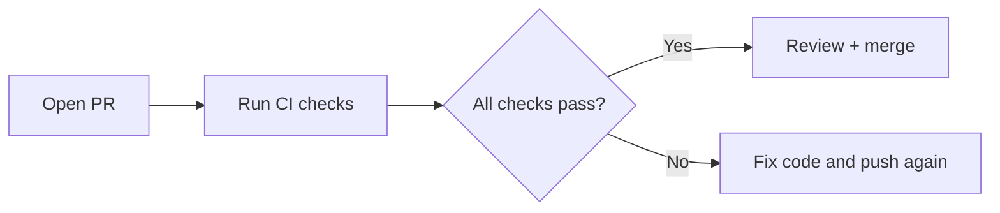

# 🚀 Lesson 17: GitHub Actions CI Checks Basics (Industry Daily)

This lesson covers the minimum CI setup every team uses to prevent broken merges.

---

## 🎯 Lesson Goal

- Understand why CI checks are mandatory before merge.
- Add a simple CI pipeline in GitHub Actions.
- Connect CI checks to branch protection rules.
- Build daily confidence with check-first workflow.

---

## 🧠 Why CI Is Critical

Without CI:
- broken code can merge to `main`
- tests may fail after merge
- team confidence drops

With CI:
- every PR is auto-validated before merge

---

## 🔁 Visual: PR + CI + Merge



---

## 1) Create Basic Workflow File

Path:
- `.github/workflows/ci.yml`

Minimal example (language-agnostic placeholder):

```yaml
name: CI
on:
  pull_request:
  push:
    branches: [main]

jobs:
  validate:
    runs-on: ubuntu-latest
    steps:
      - name: Checkout
        uses: actions/checkout@v4
      - name: Placeholder check
        run: echo "Add lint/test/build commands here"
```

---

## 2) Replace Placeholder with Real Checks

Add in this order:
1. lint
2. test
3. build

Why this order:
- faster failures first
- clearer signal for developers

---

## 3) Require CI Before Merge

In Rulesets / Branch Protection:
- Require status checks to pass before merging
- Select your CI workflow check(s)

Now failed checks block merge.

---

## 4) Daily Developer Flow

```bash
git switch -c feature/small-change
# code + commit
git push -u origin feature/small-change
```

Then:
- open PR
- wait for checks
- fix if red
- merge when green + approved

---

## 🛡️ Best Practices

- Keep CI fast and deterministic.
- Avoid flaky tests in required checks.
- Make failing logs readable.
- Never bypass failing required checks.

---

## 🧪 Practice Drill

1. Add CI workflow file.
2. Open PR with intentional small change.
3. Verify checks run automatically.
4. Fix a failing check and rerun.
5. Merge only when checks are green.

---

## ✅ Summary

You can now enforce quality gates with CI checks in a practical team-ready workflow.
