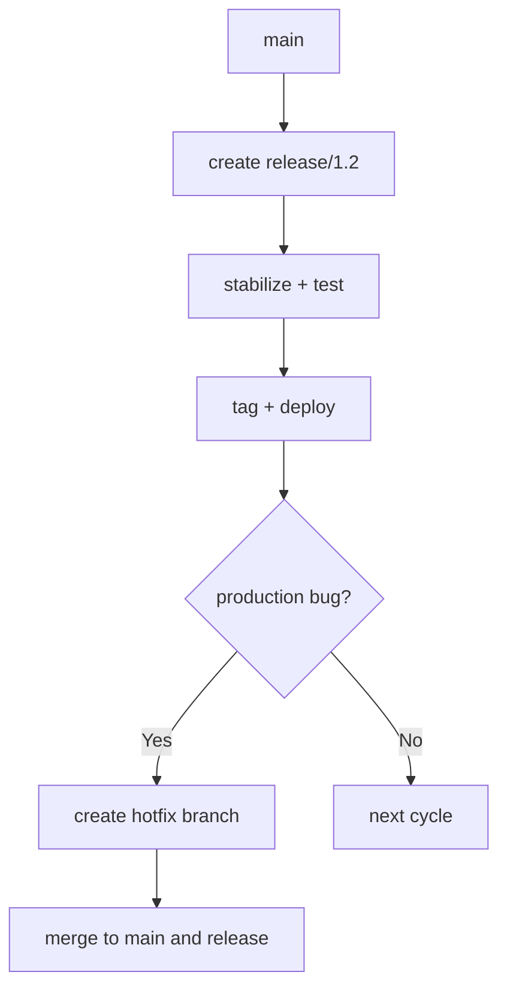

# 🚀 Lesson 18: Release Branch and Hotfix Policy (Industry Daily)

This lesson defines the minimal release policy teams use for controlled deployments.

---

## 🎯 Lesson Goal

- Understand release branch purpose.
- Apply safe hotfix process without chaos.
- Keep `main` and `release/*` consistent.
- Use a repeatable deployment-ready policy.

---

## 🧠 Core Model

- `main` = integration branch (latest stable development)
- `release/x.y` = stabilization branch for upcoming release
- `hotfix/...` = urgent production fix branch

---

## 🔁 Visual: Release + Hotfix Lifecycle



---

## 1) Create Release Branch

```bash
git switch main
git pull --rebase
git switch -c release/1.2
git push -u origin release/1.2
```

Use release branch when you need stabilization window.

---

## 2) Stabilize on Release Branch

Allowed changes:
- bug fixes
- docs
- release notes

Avoid on release branch:
- new risky features
- large refactors

---

## 3) Hotfix Workflow (Urgent Production)

```bash
git switch main
git pull --rebase
git switch -c hotfix/payment-timeout
# fix + commit
git push -u origin hotfix/payment-timeout
```

Then PR and merge quickly with review.

---

## 4) Keep Branches in Sync

After hotfix merge:
- ensure fix exists in `main`
- cherry-pick or merge same fix into active `release/*` branch if required

Example:

```bash
git switch release/1.2
git cherry-pick <hotfix-commit-hash>
```

---

## 🛡️ Policy Best Practices

- Define who can create release/hotfix branches.
- Keep hotfix PR scope extremely small.
- Tag releases consistently (`v1.2.0`, `v1.2.1`).
- Document rollback steps per release.

---

## 🧪 Practice Drill

1. Create `release/1.2`.
2. Make one stabilization fix.
3. Create `hotfix/...` branch and commit urgent fix.
4. Merge hotfix and sync it to release branch.
5. Tag release candidate.

---

## ✅ Summary

You now have a simple, reliable release/hotfix policy used in real teams.
