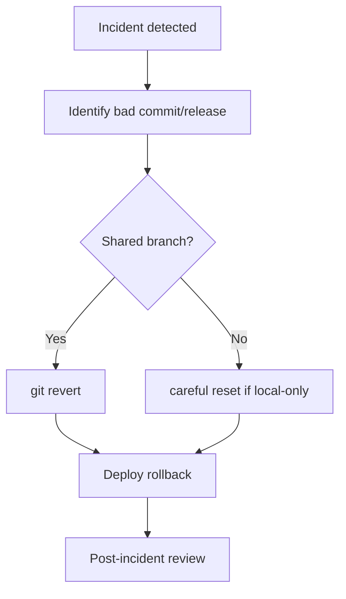

# 🚀 Lesson 19: Incident Rollback Playbook (Industry Daily)

This lesson teaches a practical rollback process for production incidents.

---

## 🎯 Lesson Goal

- Respond fast when bad changes reach production.
- Choose safe rollback strategy.
- Use Git commands without making incident worse.
- Communicate and document recovery clearly.

---

## 🧠 Incident Mindset

Priority order:
1. restore service quickly
2. minimize risk
3. preserve audit trail

In shared repos, prefer reversible actions.

---

## 🔁 Visual: Incident Response Flow



---

## 1) Identify Problematic Change

```bash
git log --oneline
git show <commit-hash>
```

Confirm exactly what should be rolled back.

---

## 2) Safe Rollback for Shared History

```bash
git revert <commit-hash>
```

For range:

```bash
git revert <oldest-hash>^..<newest-hash>
```

Why:
- keeps full history
- safest for team repositories

---

## 3) Emergency Rollback Branch

```bash
git switch -c rollback/incident-2026-02-25
# revert commit(s)
git push -u origin rollback/incident-2026-02-25
```

Then open urgent PR and merge after fast review.

---

## 4) Deploy and Verify

After rollback merge:
- deploy immediately
- verify health checks
- verify key user paths

If needed, roll forward with corrected fix in separate PR.

---

## 5) Post-Incident Checklist

- write root cause summary
- list timeline and decisions
- add guardrails (tests/checks/rules)
- link incident PR in notes

---

## 🛡️ Best Practices

- Avoid `reset --hard` on shared branches.
- Keep an incident template ready.
- Practice rollback drill monthly.
- Ensure on-call knows revert workflow.

---

## 🧪 Practice Drill

1. Create a bad commit in practice repo.
2. Simulate incident and identify hash.
3. Roll back using `git revert` on rollback branch.
4. Open urgent PR and merge.
5. Document what failed and what guardrail to add.

---

## ✅ Summary

You now have a practical rollback playbook for real incidents with safe Git operations.
