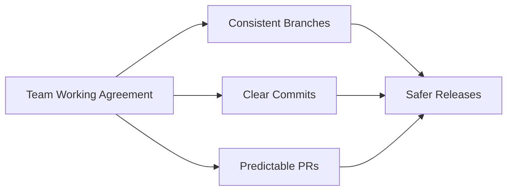

# 🚀 Lesson 20: Team Git Conventions and Working Agreements (Final Video)

This final lesson defines the day-to-day rules that make Git/GitHub collaboration smooth, predictable, and scalable.

---

## 🎯 Lesson Goal

- Standardize branch naming, commit style, and PR behavior.
- Reduce confusion during reviews and releases.
- Create a shared operating model used by the whole team.

---

## 🧠 Why This Is Final and Critical

Most Git problems in teams are not command problems; they are convention problems.

Conventions give:
- consistent history
- faster onboarding
- fewer merge mistakes
- clearer ownership and communication

---

## 🔁 Visual: Team Agreement Flow



---

## 1) Branch Naming Convention

Recommended format:
- `feature/<short-topic>`
- `fix/<short-topic>`
- `hotfix/<short-topic>`
- `docs/<short-topic>`

Examples:
- `feature/user-profile`
- `fix/token-refresh`
- `hotfix/payment-timeout`

Rules:
- lowercase only
- hyphen-separated words
- one branch = one purpose

---

## 2) Commit Message Convention

Simple, practical style:
- `Add: ...`
- `Fix: ...`
- `Refactor: ...`
- `Docs: ...`
- `Test: ...`

Examples:
- `Fix: prevent null token crash in auth middleware`
- `Docs: add rollback steps for release incidents`

Avoid:
- `update`
- `final`
- `misc changes`

---

## 3) PR Convention (Minimum Standard)

Every PR should include:
1. what changed
2. why changed
3. how tested
4. risk/impact
5. rollback note (when relevant)

Team rule:
- no self-merge on protected branches unless emergency policy allows it.

---

## 4) Daily Command Routine (Team Safe)

```bash
git switch main
git pull --rebase
git switch -c feature/your-task
# code + commit
git push -u origin feature/your-task
```

Then open PR, pass checks, get review, merge.

---

## 5) Useful Shared Git Config (Optional but Helpful)

Set rebase pull as default:

```bash
git config --global pull.rebase true
```

Auto-stash during pull rebase:

```bash
git config --global rebase.autoStash true
```

Helpful aliases:

```bash
git config --global alias.st "status -sb"
git config --global alias.lg "log --oneline --graph --decorate --all"
```

---

## 6) Team Working Agreement Template

Use this in team docs:

- Branch style: `feature|fix|hotfix|docs`
- PR size: small and focused
- Required reviews: minimum 1 (or code owners)
- Required checks: lint + test + build
- Merge strategy: squash (or team chosen standard)
- Release tagging: semantic version tags (`vX.Y.Z`)
- Incident rollback: `revert` first on shared branches

---

## 🛡️ Final Best Practices

- Prefer consistency over personal preference.
- Write history for future teammates, not just for today.
- Keep workflows documented and updated.
- Review process health every sprint.

---

## 🧪 Practice Drill

1. Create a team convention doc from this lesson.
2. Apply branch naming in next 3 tasks.
3. Enforce PR template fields.
4. Add aliases for all team members.
5. Review one PR using the checklist.

---

## ✅ Final Summary

You now have a full practical Git/GitHub track focused on real daily industry workflows:
- safe collaboration
- secure operations
- release discipline
- incident readiness
- team-level consistency
