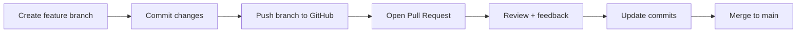

# 🚀 Lesson 08: Pull Requests and Code Review Basics (Video 8 Notes)

Day 08 completes core basics with professional collaboration workflow.

---

## 🎯 Day 08 Goal

- Understand Pull Request (PR) flow from branch to merge.
- Write clean PR title and description.
- Handle review comments professionally.
- Merge safely without breaking `main`.

---

## 🧠 Core Idea

A Pull Request is a structured request:
- “Please review my branch changes and merge into target branch.”

It adds:
- quality checks
- discussion
- traceability

---

## 🔁 Visual: PR Collaboration Flow



---

## 1) Standard PR Command Flow

```bash
git switch -c feature/login-validation
# make changes
git add .
git commit -m "Add login input validation"
git push -u origin feature/login-validation
```

Then open Pull Request on GitHub.

---

## 2) Good PR Template (Simple)

### PR Title

- `Add login input validation`

### PR Description

- What changed
- Why changed
- How tested
- Screenshots (if UI)

---

## 3) Handle Review Comments Correctly

Workflow:
1. Read all comments first.
2. Make requested fixes in same branch.
3. Commit clearly.
4. Push again.
5. Reply to comments with what you changed.

Example follow-up commit:

```bash
git commit -m "Address review: improve email validation message"
```

---

## 4) Merge Strategies (Beginner Guidance)

- **Squash and merge**: best for clean history in many teams.
- **Merge commit**: keeps full branch commit structure.

Beginner recommendation:
- Start with **Squash and merge** unless team says otherwise.

---

## 🛡️ Team Best Practices

- Keep PR small and focused.
- Open PR early (even draft) for faster feedback.
- Never mix unrelated changes in one PR.
- Ensure latest `main` is synced before final merge.

---

## 🧪 Practice Drill (Day 08)

1. Create a small feature branch.
2. Make one focused change.
3. Push branch.
4. Open PR with clear description.
5. Add one follow-up commit after self-review.
6. Merge with squash.

---

## ✅ Day 08 Summary

You now understand professional beginner collaboration:
- branch-first development
- PR-based review
- safe merge habits
- clean team communication
